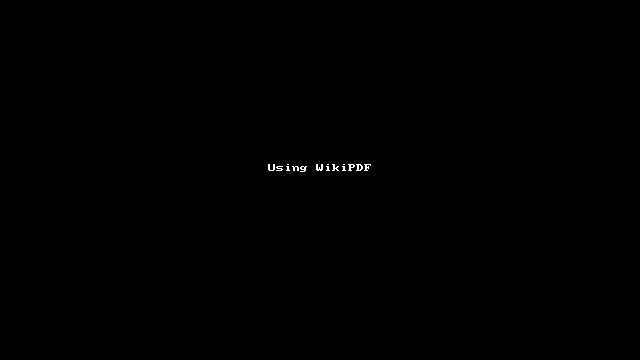
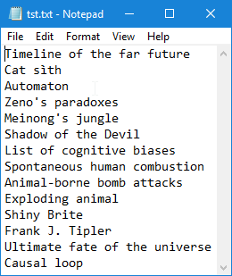
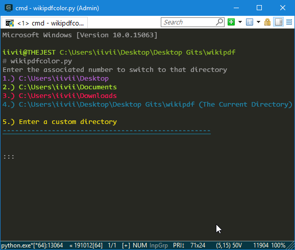

# WikiPDF

<!-- Synopsis -->
Included here are 2 scripts, which will download a list of wikipedia pages in PDF format without going through the hassle of clicking the "Download Page as PDF" link every time you find an interesting article.

<!-- Image 1 -->

<!-- Basic Explanation -->
> `wikipdfcolor.py`
> + The **new and improved** version! As long as you've got a decent terminal (I recommend [ConEmu](https://conemu.github.io/) for Windows users!), you should have a lovely, color coded and more intuitive experience overall using the script!
> 
> `wikipdf.py` 
> + The classic version. Uglier, less user friendly.

---

How To Use the Script
---------------------

+ Save this git in the folder you'd like to run the code from. I'll say it's `C:\Users\{your_name}\Desktop` for this example.
+ Extract the zip file to a folder on the Desktop called `WikiPDF` or whatever you want.
+ See the file in there called **`tst.txt`**? That's how you need to format the `.txt` files for whatever pages you want to download. If they aren't on new lines, or written just like they are in their actual wikipedia page titles, you may see errors.
  + Here's a nice photo, just to have a visual reference of how it should look.
  
  + > 

+ Run **`wikipdf.py`** or **`wikipdfcolor.py`** - _your choice_. A console window will pop up. Here's a clip of me using the color version.
  + > 
+ The _color_ version will give you a couple of different regularly used file locations, along with the folder you launched the program from. You can enter the corresponding number to make a selection, and then press `ENTER`.
  + You can also choose to enter a _custom directory_ by choosing option 5, and then typing in any path you'd like.
  + The _classic_ version requires you to enter the location that the textfile you want to use is in. It's bad, and less pretty, and I don't think you should use this one. (_The code is less efficient and more obnoxious too!_)
+ After making your selection, all `.txt` files present in the chosen directory will be displayed without their extensions visible. This is just for aesthetics, **I promise** they are `.txt` files.
+ Finally, enter the file's name (in the example it's `tst`) and pres **`ENTER`**.

**BOOM!**

_The magic begins!_

---

_With Solidarity,_

:crystal_ball: [__*iivii*__](https://merveilles.town/@thelibrarian)
